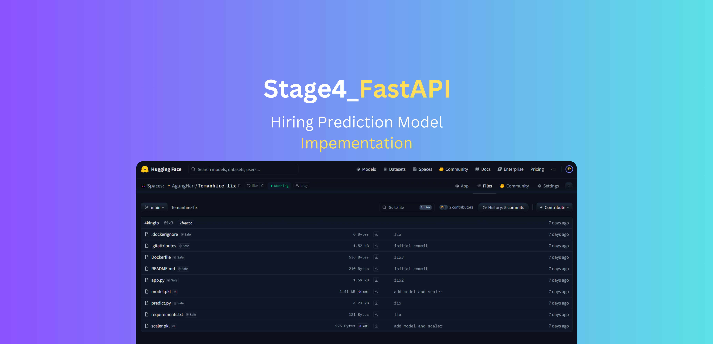

[](https://huggingface.co/spaces/AgungHari/Temanhire-fix/tree/main)


# Stage 4 - Hiring Prediction FastAPI App
This repository contains a FastAPI application that predicts hiring outcomes based on candidate data. The app uses a trained machine learning model to evaluate candidates and provide scores and notes.


## API Endpoints

### POST /score
Predicts hiring outcome for a candidate.

**Headers:**
- `x-api-key`: API key for authentication

**Request Body:**
```json
{
  "name": "string",
  "interview_score": 100,
  "skill_score": 100,
  "personality_score": 100,
  "education_level": "string",
  "recruitment_strategy": "string",
  "experience_level": "string",
  "status": "string"
}
```

**Response:**
```json
{
    "ai_score": 78,
    "ai_notes": "Skor dihitung dari Interview=80, Skill=75, Personality=70, Edu=Bachelor, Exp=Junior.",
    "proba": 0.78,
    "passed": true
}
```

## Prerequisites
- Python 3.11+
- Docker (optional, for containerization)
- Required Python packages listed in `requirements.txt`


## Docker Setup
The application can be containerized using Docker. The Dockerfile includes:

- Python 3.11 slim base image
- Non-root user setup for security
- Automatic dependency installation
- Application code and model artifact copying
- Exposed port 7860 (default for Hugging Face Spaces)

### Building and Running with Docker

```bash
# Build the Docker image
docker build -t hiring-prediction-app .

# Run the container
docker run -p 7860:7860 hiring-prediction-app
```

The application will be accessible at `http://localhost:7860`

### Docker Environment Variables
No additional environment variables are required. The application uses default configurations specified in the code.

### Docker Security Notes
- Uses non-root user for enhanced security
- Minimal base image to reduce attack surface
- Proper file ownership with --chown

## Hugging Face Spaces Configuration
The application is configured to run on Hugging Face Spaces

Check out the configuration reference at https://huggingface.co/docs/hub/spaces-config-reference

## Local Setup
To run the application locally, follow these steps:

```bash
# Clone the repository
git clone https://github.com/4Kings-Rakamin/Stage4_FastAPI_Deployment.git

cd Stage4_FastAPI_Deployment

# Create a virtual environment
python -m venv venv
source venv/bin/activate  # On Windows use `venv\Scripts\activate`

# Install dependencies
pip install -r requirements.txt

# Run the FastAPI app
uvicorn main:app --reload --host
```

The application will be accessible at `http://localhost:8000`

## Docs
API documentation is automatically generated by FastAPI and can be accessed at:
- Swagger UI: https://agunghari-temanhire-fix.hf.space/docs
